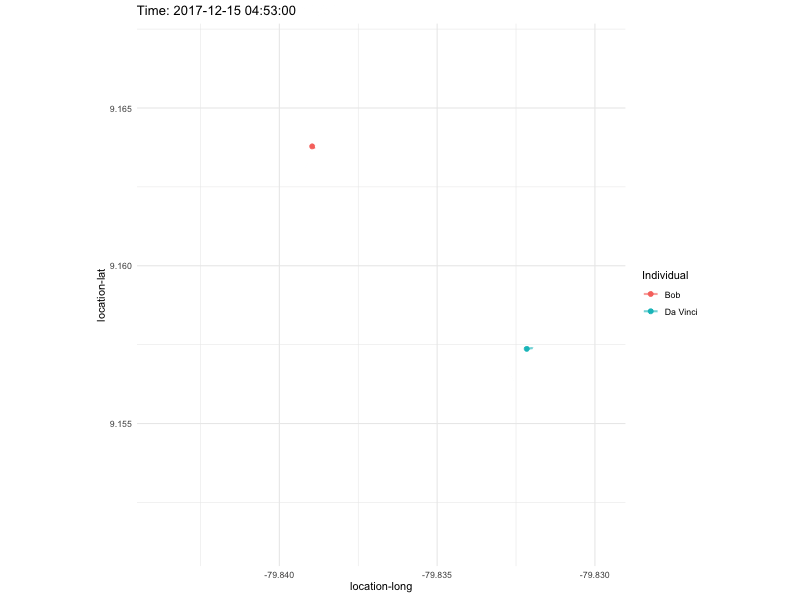
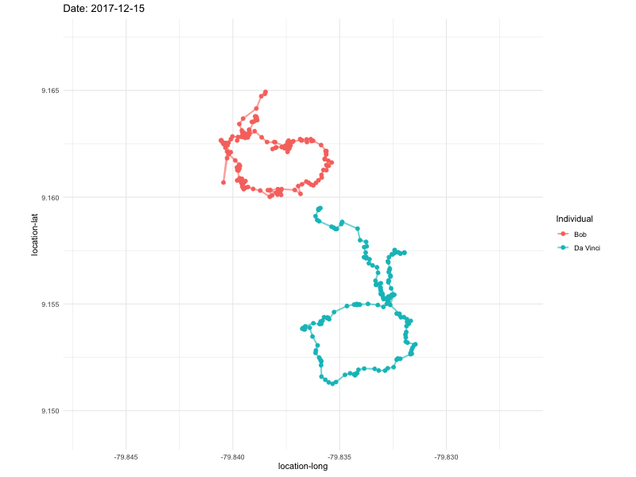

```{r setup, include=FALSE}
knitr::opts_chunk$set(echo = TRUE)

# Install pacman if needed
if (!require("pacman")) install.packages("pacman")

# Install and load all required packages
pacman::p_load(leaflet, maps, tidyverse, adehabitatHR, sp, ggplot2, gganimate, lubridate, gifski, skimr)
```

The dataset consists of GPS tracking records of two capuchin monkeys in Panama.

```{r}
d <- read_csv("./data/Food_for_thought_Cebus_capucinus_Bob_DaVinci.csv")
d<- d %>%
  dplyr::select("timestamp","location-long","location-lat","individual-local-identifier")

skim(d)
```

# 1. Leaflet Map

First, an interactive map similar to a GIS software interface was created using Leaflet. The GPS points of the two monkeys and their estimated home ranges were visualized on the map.

```{r}
# Convert data into a SpatialPointsDataFrame
d_spdf <- SpatialPointsDataFrame(
  coords = dplyr::select(d, "location-long", "location-lat"),
  data = d,
  proj4string = CRS("+proj=longlat +datum=WGS84")
)
# Split by tag ID and calculate 95% MCP for each individual
mcp_out <- d_spdf %>%
  split(.$`individual-local-identifier`) %>%
  lapply(mcp, percent = 95) %>%
  do.call(what = rbind)

# Calculate center coordinates
center_lon <- median(d$`location-long`)
center_lat <- median(d$`location-lat`)

# Create a color palette based on unique individual identifiers
pal <- colorFactor("viridis", levels = unique(d$`individual-local-identifier`))

# Create leaflet map
leaflet(d) %>%
  addProviderTiles("CartoDB.Positron") %>%
  # Bob points
  addCircleMarkers(data = d %>% filter(`individual-local-identifier` == "Bob"),
             lng = ~`location-long`, lat = ~`location-lat`,
             color = ~pal(`individual-local-identifier`),
             radius = 1, stroke = FALSE, fillOpacity = 1,
             group = "Bob") %>%
  # Da Vinci points
  addCircleMarkers(data = d %>% filter(`individual-local-identifier` == "Da Vinci"),
             lng = ~`location-long`, lat = ~`location-lat`,
             color = ~pal(`individual-local-identifier`),
             radius = 1, stroke = FALSE, fillOpacity = 1,
             group = "Da Vinci") %>%
  # Add legend for tag IDs
  addLegend(position = "bottomright", pal = pal, values = ~`individual-local-identifier`, title = "tag_ID", opacity = 1) %>%
  # Add MCP polygons
  addPolygons(data = mcp_out,
              color = 'blue',
              weight = 2,
              fillOpacity = 0.3,
              group = "Home Range") %>%
  # Add legend for MCP
  addLegend(position = "bottomright", colors = "blue", labels = "MCP 95%") %>%
  # Add layer toggle control
  addLayersControl(overlayGroups = c("Home Range", "Bob", "Da Vinci"), options = layersControlOptions(collapsed = FALSE)) %>%
  setView(lng = center_lon,
          lat = center_lat,
          zoom = 15)

```


# 2. Trajectory GIF

The movement paths of the animals were plotted over time and visualized through an animated GIF. Due to memory constraints, only a few days of data were used.

```{r, eval=FALSE}
# 1. Prepare the data
# Select the first 900 rows for each individual monkey
d_sample <- d %>%
  group_by(`individual-local-identifier`) %>%
  slice(1:900) %>% 
  ungroup() %>%
  mutate(timestamp = as.POSIXct(timestamp)) %>%
  arrange(`individual-local-identifier`, timestamp)

# 2. Create a full sequence of timestamps (1-second interval)
full_time_seq <- seq(from = min(d_sample$timestamp), 
                     to = max(d_sample$timestamp), 
                     by = "1 sec")

# 3. Fill missing data points for each individual
d_filled <- expand.grid(
  timestamp = full_time_seq,
  `individual-local-identifier` = unique(d_sample$`individual-local-identifier`)
) %>%
  left_join(d_sample, by = c("timestamp", "individual-local-identifier")) %>%
  group_by(`individual-local-identifier`) %>%
  fill(`location-long`, `location-lat`, .direction = "down") %>%
  ungroup()

# 4. Create a plot object
p <- ggplot(d_filled, aes(x = `location-long`, y = `location-lat`, color = `individual-local-identifier`)) +
  geom_path(aes(group = `individual-local-identifier`), linewidth = 1, alpha = 0.6) +
  geom_point(size = 2) +
  transition_reveal(timestamp) +
  labs(title = "Time: {frame_along}", color = "Individual") +
  theme_minimal() +
  coord_fixed()

# 5. Animate and save
animate(p, nframes = 200, fps = 10, width = 800, height = 600, renderer = gifski_renderer("bob_davinci_trajectory.gif"))

```

```{r}

```

Due to the large number of points, I visualized the trajectories separately for each day.

```{r, eval=FALSE}
# 1. Prepare the data
d_sample <- d %>%
  group_by(`individual-local-identifier`) %>%
  ungroup() %>%
  mutate(timestamp = as.POSIXct(timestamp)) %>%
  arrange(`individual-local-identifier`, timestamp)

d_sample <- d_sample %>%
  mutate(date = as.Date(timestamp)) 

# 2. Create a plot object
p <- ggplot(d_sample, aes(x = `location-long`, y = `location-lat`, color = `individual-local-identifier`)) +
  geom_path(aes(group = `individual-local-identifier`), linewidth = 1, alpha = 0.6) +
  geom_point(size = 2) +
  transition_states(date, transition_length = 1, state_length = 1) + 
  labs(title = "Date: {closest_state}", color = "Individual") +
  theme_minimal() +
  coord_fixed()

# 3. Animate
animate(p, nframes = length(unique(d_sample$date)), fps = 1, width = 800, height = 600, renderer = gifski_renderer("bob_davinci_trajectory_daily.gif"))

```

```{r}

```
